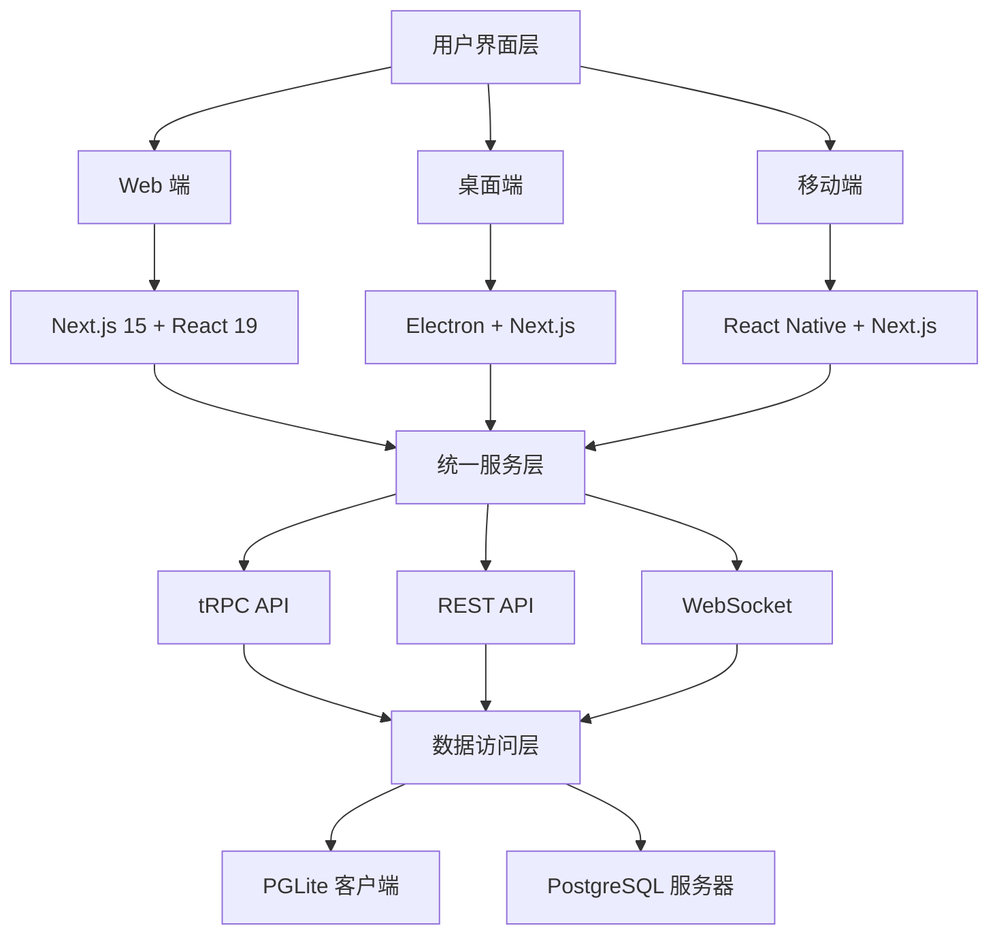
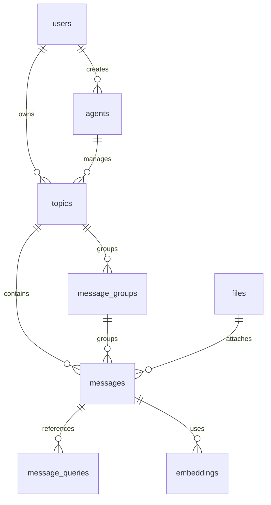

# LobeChat 技术分析报告 - Claude 专用

> **生成时间**: 2025-10-20
> **项目版本**: v1.139.1
> **分析深度**: 完整技术架构解析
> **用途**: Claude AI 助手项目理解专用文档

## 📋 项目概览

### 基本信息

- **项目名称**: LobeChat (原 @lobehub/chat)
- **技术定位**: 开源现代化 AI 聊天框架
- **核心特色**: 多端统一、插件生态、企业级特性
- **开发状态**: 活跃开发中 (日更新频率)
- **社区规模**: GitHub Star 数量级项目

### 技术标签

```typescript
{
  "framework": "chatbot",
  "stack": ["nextjs", "react", "typescript"],
  "ai": ["chatgpt", "openai", "anthropic", "multimodal"],
  "features": ["tts", "stt", "plugin-system", "rag"],
  "deployment": ["vercel", "docker", "electron"]
}
```

## 🏗️ 核心架构设计

### 1. 多端统一架构 (Multi-Platform Unified Architecture)



### 2. 技术栈分层架构

#### 前端技术栈 (Frontend Stack)

```typescript
const frontendStack = {
  framework: 'Next.js 15 + React 19',
  ui: {
    components: '@lobehub/ui + Ant Design 5',
    styling: 'antd-style (CSS-in-JS)',
    icons: 'lucide-react + @ant-design/icons',
    layout: 'react-layout-kit',
  },
  state: {
    management: 'Zustand (切片式组织)',
    query: 'SWR + @tanstack/react-query',
    form: 'react-hook-form + zod',
  },
  i18n: {
    framework: 'react-i18next',
    locales: '支持多语言动态切换',
  },
  animation: {
    library: 'framer-motion + react-spring',
  },
};
```

#### 后端技术栈 (Backend Stack)

```typescript
const backendStack = {
  api: {
    framework: 'Next.js API Routes + tRPC',
    typeSafety: '端到端 TypeScript 类型安全',
    validation: 'Zod Schema 验证',
  },
  database: {
    client: 'PGLite (WASM 版本)',
    server: 'PostgreSQL + Neon Cloud',
    orm: 'Drizzle ORM + Drizzle Zod',
    migration: '自动化数据库迁移',
  },
  auth: {
    providers: ['NextAuth', 'Clerk', 'OIDC Provider'],
    strategies: ['OAuth', 'JWT', 'SSO'],
  },
  monitoring: {
    tracing: 'OpenTelemetry',
    logging: 'Pino + Winston',
    analytics: 'Vercel Analytics + PostHog',
  },
};
```

### 3. 数据流架构 (Data Flow Architecture)

#### 三种数据流模式

**模式 1: Web 客户端数据库模式**

```typescript
// 数据流向：React UI → Client Service → PGLite (WASM)
const clientDBFlow = {
  path: 'React UI → Client Service → Zustand Store → PGLite → 本地存储',
  advantages: ['离线优先', '零延迟', '数据主权'],
  useCase: '个人使用，数据私密性要求高',
};
```

**模式 2: Web 服务器数据库模式**

```typescript
// 数据流向：React UI → tRPC → Server Services → PostgreSQL
const serverDBFlow = {
  path: 'React UI → tRPC Router → Server Services → Drizzle ORM → PostgreSQL',
  advantages: ['数据同步', '团队协作', '云端备份'],
  useCase: '团队协作，多设备同步',
};
```

**模式 3: 桌面端混合模式**

```typescript
// 双模式支持
const desktopFlow = {
  localMode: 'Electron UI → tRPC → Local Server → PGLite (Node WASM)',
  cloudMode: 'Electron UI → tRPC → Cloud Server → PostgreSQL',
  switching: '支持本地/云端模式动态切换',
};
```

## 🧠 AI/ML 技术架构

### 1. 模型运行时系统 (Model Runtime System)

```typescript
// 支持的 AI 提供商架构
const modelProviders = {
  openai: { models: ['gpt-4', 'gpt-3.5-turbo'], features: ['chat', 'embedding', 'vision'] },
  anthropic: { models: ['claude-3'], features: ['chat', 'vision'] },
  google: { models: ['gemini-pro'], features: ['chat', 'embedding'] },
  azure: { models: ['azure-openai'], features: ['chat', 'embedding'] },
  // ... 50+ 提供商
};

// 统一的模型调用接口
interface ModelRuntime {
  chatCompletion(params: ChatParams): Promise<ChatResponse>;
  generateEmbedding(text: string): Promise<EmbeddingResponse>;
  streamChat(params: ChatParams): AsyncIterable<ChatChunk>;
}
```

### 2. 插件系统架构 (Plugin System)

```typescript
// 插件网关设计
const pluginGateway = {
  architecture: '网关模式 + 沙箱执行',
  typeSafety: 'TypeScript + OpenAPI Schema',
  permission: '细粒度权限控制',
  discovery: '插件市场自动发现',
};

// 插件接口标准
interface ChatPlugin {
  manifest: PluginManifest;
  handler: (request: PluginRequest) => Promise<PluginResponse>;
  permissions: PluginPermission[];
}
```

### 3. RAG 系统设计 (Retrieval Augmented Generation)

```typescript
const ragSystem = {
  embedding: {
    provider: '多向量数据库支持',
    chunking: '智能文档分块',
    indexing: '语义索引构建',
  },
  retrieval: {
    search: '混合检索 (语义 + 关键词)',
    ranking: '重排序算法',
    filtering: '多维度过滤',
  },
  generation: {
    context: '动态上下文注入',
    citation: '引用来源标记',
    grounding: '事实核查支持',
  },
};
```

## 🗄️ 数据库设计精髓

### 1. 核心表结构设计

```sql
-- 消息表：支持丰富的 AI 对话场景
CREATE TABLE messages (
  id TEXT PRIMARY KEY,
  role VARCHAR(255) NOT NULL,           -- user/assistant/system
  content TEXT,                         -- 消息内容
  reasoning JSONB,                      -- 推理过程 (AI 思考链)
  search JSONB,                        -- 搜索结果 (RAG 引用)
  tools JSONB,                         -- 工具调用记录
  trace_id TEXT,                       -- 分布式追踪 ID
  message_group_id VARCHAR(255),       -- 多模型并行对话组
  embeddings_id UUID,                  -- 向量检索关联
  created_at TIMESTAMP DEFAULT NOW(),
  updated_at TIMESTAMP DEFAULT NOW()
);

-- 消息分组表：支持多模型并行对话
CREATE TABLE message_groups (
  id VARCHAR(255) PRIMARY KEY,
  topic_id TEXT REFERENCES topics(id) ON DELETE CASCADE,
  user_id TEXT REFERENCES users(id) ON DELETE CASCADE,
  parent_group_id VARCHAR(255) REFERENCES message_groups(id) ON DELETE CASCADE,
  parent_message_id TEXT REFERENCES messages(id) ON DELETE CASCADE,
  title VARCHAR(255),
  created_at TIMESTAMP DEFAULT NOW()
);

-- 向量嵌入表：支持语义搜索
CREATE TABLE embeddings (
  id UUID PRIMARY KEY DEFAULT gen_random_uuid(),
  content TEXT NOT NULL,
  embedding vector(1536),              -- OpenAI 向量维度
  metadata JSONB,
  created_at TIMESTAMP DEFAULT NOW()
);
```

### 2. 数据库关系图谱



## 🔧 开发工具链和规范

### 1. 包管理策略

```json
{
  "execution": {
    "scripts": "bun / bunx",
    "build": "Next.js + Turbopack",
    "test": "Vitest + Playwright"
  },
  "packageManager": "pnpm@10.18.3",
  "workspaces": ["packages/*"]
}
```

### 2. 代码质量工具链

```typescript
const codeQuality = {
  linting: {
    typescript: 'ESLint + @typescript-eslint',
    style: 'Stylelint + antd-style',
    format: 'Prettier + 自动格式化',
  },
  typeChecking: {
    compiler: 'TypeScript 5.9 (严格模式)',
    validation: 'tsgo --noEmit',
    coverage: '端到端类型覆盖',
  },
  testing: {
    unit: 'Vitest + happy-dom',
    integration: '测试数据库隔离',
    e2e: 'Playwright + 多浏览器',
  },
  git: {
    workflow: 'gitmoji + 语义化提交',
    branching: 'tj/feat/feature-name',
    hooks: 'Husky + lint-staged',
  },
};
```

### 3. TypeScript 代码规范

```typescript
// 类型安全最佳实践
const codingStandards = {
  typeInference: '优先类型推断，避免显式注解',
  interfaces: '对象形状使用 interface，联合类型使用 type',
  async: 'async/await 优于 Promise.then',
  error: '@ts-expect-error 优于 @ts-ignore',
  components: 'React 组件Props 使用 interface 定义',
  utils: '工具函数优先使用 packages/utils',
};
```

## 🚀 部署和运维

### 1. 多环境部署策略

```typescript
const deploymentStrategy = {
  web: {
    production: 'Vercel Edge + 全球 CDN',
    selfHosted: 'Docker 容器化 + 环境变量配置',
    preview: '自动预览部署 + 分支环境',
  },
  desktop: {
    macOS: 'electron-builder + Code Signing',
    windows: 'electron-builder + NSIS 安装包',
    linux: 'electron-builder + AppImage',
  },
  mobile: {
    development: 'React Native + Expo',
    production: '原生打包 + 应用商店发布',
  },
};
```

### 2. 性能优化策略

```typescript
const performanceOptimization = {
  frontend: {
    bundling: 'Next.js 自动代码分割',
    caching: '静态资源长期缓存 + CDN',
    images: '自动格式转换 + 响应式图片',
    loading: 'Suspense + 懒加载',
  },
  backend: {
    database: '复合索引优化 + 连接池管理',
    api: 'tRPC 批量请求 + 边缘缓存',
    streaming: '响应流式传输 + 服务端推送',
  },
  monitoring: {
    metrics: 'OpenTelemetry + Jaeger 追踪',
    analytics: '用户行为分析 + 性能监控',
    alerts: '错误报告 + 自动告警',
  },
};
```

## 🎯 关键技术决策分析

### 1. 架构选择理由

**为什么选择 Next.js 15 + React 19？**

- ✅ 最新的 App Router 架构支持
- ✅ 服务端组件 (RSC) 性能优势
- ✅ 内置优化和边缘计算支持
- ✅ 完善的 TypeScript 集成

**为什么选择 PGLite + PostgreSQL 双数据库？**

- ✅ Web 端 WASM 数据库支持离线使用
- ✅ 服务器端企业级数据库保证可靠性
- ✅ 统一的 ORM 层简化开发复杂度
- ✅ 支持本地 / 云端数据灵活切换

**为什么选择 tRPC 而不是纯 REST API？**

- ✅ 端到端类型安全
- ✅ 自动客户端类型生成
- ✅ 更好的开发体验
- ✅ 支持批量请求和实时更新

### 2. 技术创新点

**多模型并行对话系统**

```typescript
// 创新点：多个 AI 模型同时响应同一用户消息
const parallelChat = {
  feature: 'message_groups 表设计',
  benefit: '用户可以同时比较不同 AI 模型的回答',
  implementation: '嵌套分组 + 消息关联',
};
```

**插件沙箱执行环境**

```typescript
// 创新点：安全的插件执行环境
const pluginSandbox = {
  feature: '网关模式 + 权限控制',
  benefit: '安全执行第三方插件代码',
  implementation: 'API 代理 + 资源限制',
};
```

**统一的多端状态管理**

```typescript
// 创新点：跨平台状态同步
const stateSync = {
  feature: 'Zustand + 持久化中间件',
  benefit: 'Web、桌面、移动端状态一致',
  implementation: '统一状态层 + 数据同步',
};

// 创新点：异步任务与模型调用全链路携带用户标头
const userHeaderPropagation = {
  feature: 'ctx.ip 在 asyncAuth 中保留，createAsyncCaller 透传到各类 async pipeline',
  benefit: '支持审计、限流与合规追踪，确保模型请求具备 x-user-id / x-user-ip',
  implementation: [
    'src/libs/trpc/async/asyncAuth.ts',
    'src/server/routers/async/caller.ts',
    'src/server/services/chunk/index.ts',
    'src/server/routers/lambda/chunk.ts',
    'src/server/routers/lambda/ragEval.ts',
    'src/server/routers/async/image.ts',
    'src/server/routers/async/ragEval.ts',
  ],
};
```

## 📊 项目成熟度评估

### 技术债务分析

```typescript
const technicalDebt = {
  low: ['代码质量', '类型安全', '测试覆盖率'],
  medium: ['文档完整性', '性能优化'],
  high: ['移动端支持', '插件生态'],
};
```

### 可维护性评估

```typescript
const maintainability = {
  architecture: '优秀 (模块化设计)',
  codeQuality: '优秀 (严格 TS + 规范)',
  testing: '良好 (单元测试 + E2E)',
  documentation: '良好 (MDX + 代码注释)',
  community: '优秀 (活跃贡献 + issue 响应)',
};
```

## 🔮 未来发展方向

### 技术路线图

- **2025 Q1**: 移动端正式版发布
- **2025 Q2**: 企业版功能增强
- **2025 Q3**: AI Agent 市场生态
- **2025 Q4**: 多租户 SaaS 版本

### 技术演进趋势

- **边缘计算**: 更多计算迁移到边缘节点
- **AI 原生**: 深度集成更多 AI 能力
- **实时协作**: 多用户实时协作功能
- **隐私保护**: 端到端加密和数据主权

---

## 💡 Claude 使用建议

### 开发环境快速上手

```bash
# 1. 安装依赖
pnpm install

# 2. 启动开发服务器
bun dev         # Web 端 (端口 3010)
bun dev:desktop # 桌面端 (端口 3015)

# 3. 运行测试
bunx vitest run --silent='passed-only' 'src/**/*.test.ts'

# 4. 类型检查
bun run type-check

# 5. 数据库操作
bun run db:generate # 生成 schema
bun run db:studio   # 数据库可视化
```

### 关键文件位置速查

```typescript
const importantFiles = {
  // 核心服务
  chatService: 'src/services/chat/index.ts',
  userStore: 'src/store/user/index.ts',

  // 数据库 schema
  messageSchema: 'packages/database/src/schemas/message.ts',
  userSchema: 'packages/database/src/schemas/user.ts',

  // API 路由
  chatAPI: 'src/app/(backend)/webapi/chat/[provider]/route.ts',
  trpcRouter: 'src/server/routers/',

  // 配置文件
  nextConfig: 'next.config.ts',
  dependencies: 'package.json',
};
```

### 调试技巧

```typescript
const debuggingTips = {
  chatFlow: '在 ChatService.createAssistantMessage 添加断点',
  stateUpdate: '查看 Zustand DevTools',
  database: '使用 drizzle:studio 查看数据',
  network: '检查 Network 面板的 tRPC 请求',
  errors: '查看 Console 的 debug 日志',
};
```

---

**📝 更新日志**: 当项目有重大架构变更时，请更新此文档
**🔄 同步频率**: 建议每月同步一次项目状态
**📞 联系方式**: 如有技术问题，请查阅项目 GitHub Issues
